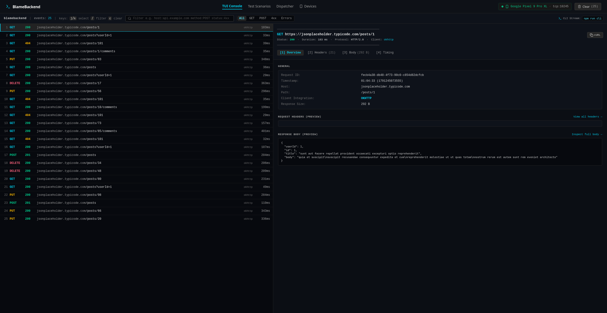
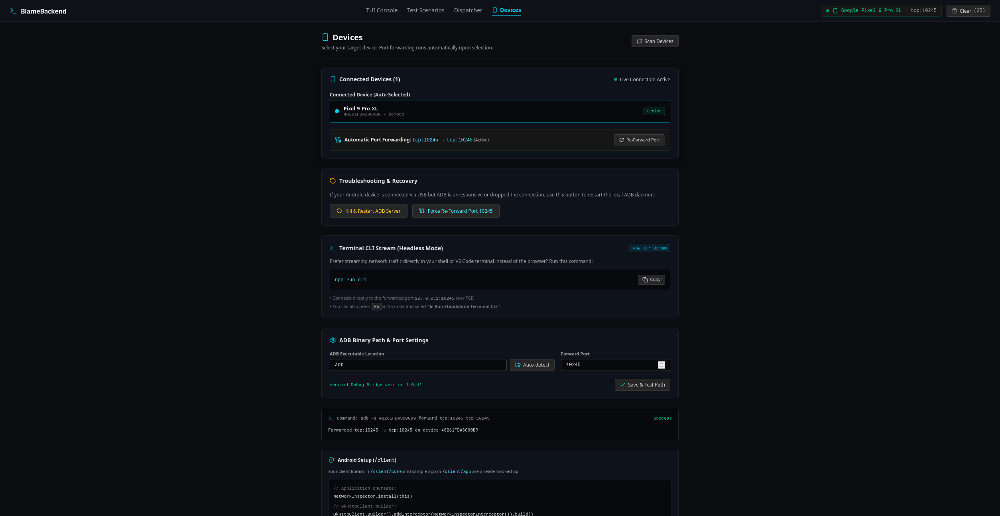
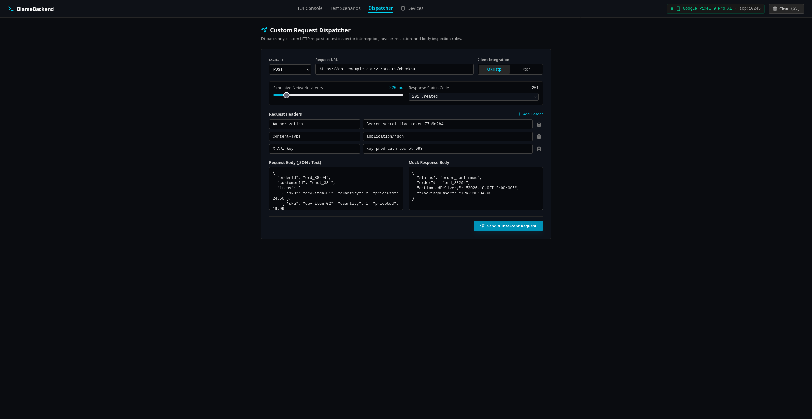
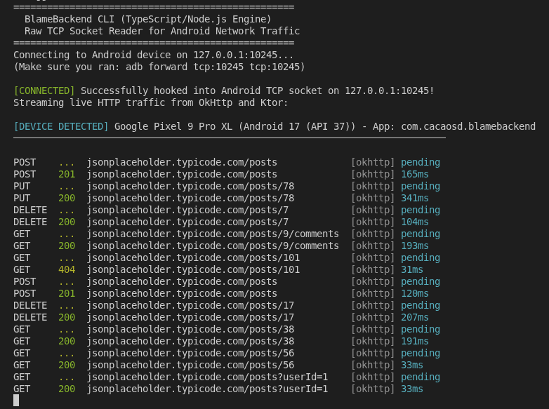

# BlameBackend

> **Real-time Android Network Inspector & Terminal TUI for OkHttp and Ktor.**  
> BlameBackend captures HTTP/HTTPS traffic directly from your Android app over a local TCP socket, streaming requests, responses, headers, and timings straight into a modern terminal-style web console or headless shell CLI.

> **Note:** Vibe coded. No idea where it goes.



---

## Notice: Client Library Status

> ⚠️ **The Android client library is still actively under development.**  
> There is **no published artifact (Maven Central / JitPack) yet**. To use it in your app, include the `:core` module locally from `/client/core`:
>
> ```kotlin
> implementation(project(":core"))
> ```

---

## Features

- **Zero Semantics Alteration**: Intercepts requests and responses non-destructively using OkHttp's `peekBody`.
- **Automatic Port Forwarding**: Automatically detects attached USB devices and emulators, forwarding `tcp:10245` on selection.
- **Interactive TUI Console**: Keyboard-driven UI (`j`/`k` navigation, `/` search, `c` clear, `Tab` panel switching).
- **Headless Terminal CLI**: Stream colored requests directly in your shell (`blamebackend --cli`).
- **Sensitive Data Redaction**: Automatic redaction of auth tokens, cookies, and secret headers.
- **Binary & Image Inspection**: Safe hex preview for non-text payloads.

---

## Installation & Running

### Option 1: Run with `npx` (No Install Required)

```bash
# Launch the Web Console (opens on http://localhost:3000)
npx blamebackend

# Or stream traffic directly in your terminal
npx blamebackend --cli
```

---

### Option 2: Install from GitHub Releases

Download `blamebackend-1.0.0.tgz` and `checksums.txt` from the [Releases](https://github.com/cagdasc/Vibe-BlameBackend/releases) page:

```bash
# 1. (Optional) Verify checksum
sha256sum -c checksums.txt

# 2. Install globally from GitHub Release URL:
npm install -g https://github.com/cagdasc/Vibe-BlameBackend/releases/download/v1.0.0/blamebackend-1.0.0.tgz

# 3. Run anywhere:
blamebackend        # Web Console
blamebackend --cli  # Terminal CLI
```

---

### Option 3: Run from Source

```bash
# Clone the repository
git clone https://github.com/cagdasc/Vibe-BlameBackend.git
cd Vibe-BlameBackend

# Install dependencies
npm install

# Start development server (http://localhost:3000)
npm run dev

# Or run terminal CLI
npm run cli
```
*(In VS Code, you can also press `Ctrl+Shift+B` / `Cmd+Shift+B` to launch the server, or press `F5` to debug).*

---

## Android App Setup

### 1. Initialize SDK

```kotlin
// In your Application.onCreate:
NetworkInspector.install(this)

// In your OkHttpClient builder:
val client = OkHttpClient.Builder()
    .addInterceptor(NetworkInspectorInterceptor())
    .build()
```

### 2. Build & Run the Sample App

```bash
cd client
./gradlew installDebug
```

Open the **Devices** tab in BlameBackend—your device is auto-selected and port-forwarded.



## Desktop Client

Run the desktop Compose client from the `client` directory:

```bash
./gradlew :composeApp:run
```

The desktop client listens on `127.0.0.1:10245` and streams Ktor request events using the same inspector protocol as the Android client.

### 3. Custom Request Dispatcher

Test endpoint edge cases or inject custom payloads directly into the inspector using the built-in Dispatcher:



### 4. Standalone Terminal CLI Preview

```bash
blamebackend --cli
# or: npm run cli
```



---

## License

```text
Copyright 2026 Cagdas

Licensed under the Apache License, Version 2.0 (the "License");
you may not use this file except in compliance with the License.
You may obtain a copy of the License at

    http://www.apache.org/licenses/LICENSE-2.0

Unless required by applicable law or agreed to in writing, software
distributed under the License is distributed on an "AS IS" BASIS,
WITHOUT WARRANTIES OR CONDITIONS OF ANY KIND, either express or implied.
See the License for the specific language governing permissions and
limitations under the License.
```
